# cutlog

cutlog は、数秒間の短い動画（以下「カット」といいます）を日常的に記録し、一日単位で振り返るための Web アプリケーションです。自身が管理するサーバー上で運用すること（セルフホスト）を前提としており、記録したデータはすべて利用者の管理下に置かれます。

専用アプリケーションのインストールは不要です。ブラウザーのみで、撮影から閲覧、書き出しまでを行えます。

```
docker compose up -d   →  http://localhost:8787
```

---

## 目次

- [1. 特徴](#1-特徴)
- [2. 画面と機能](#2-画面と機能)
- [3. 導入手順](#3-導入手順)
- [4. 設定項目](#4-設定項目)
- [5. 更新手順](#5-更新手順)
- [6. 動作要件](#6-動作要件)
- [7. ライセンス](#7-ライセンス)

---

## 1. 特徴

**エンコード処理を伴わない連続再生**

その日に撮影した複数のカットを、あたかも一本の動画であるかのように連続再生します。サーバー側での動画結合処理を必要としないため、撮影した直後から待ち時間なく再生できます。

**カット単位でのデータ管理**

記録はカット単位で保持されます。一日分がひとつのファイルに固定されることはなく、任意のカットのみを選択して書き出すこと、非表示にすること、別のログへ移動することが可能です。

**データの可搬性**

書き出し機能では、元の動画ファイルに加えて、撮影日時・タイムゾーン・再生時間・解像度・使用カメラ・撮影位置・SHA-256 チェックサム等のメタデータを `cuts.json` および `cuts.csv` として同梱します。他のシステムへ移行する場合にも、記録内容を損なうことなく持ち出せます。

**外部サービスへの非依存**

標準構成では、外部のクラウドサービスやコンテンツ配信網（CDN）への通信は発生しません。地図タイルの取得のみ外部通信を伴いますが、この配信元は設定により変更または無効化できます。

---

## 2. 画面と機能

画面は、下部のタブバーによって「カメラ」「カット一覧」「ログ」「マップ」「設定」の5つに区分されます。

### 2.1 ログ一覧

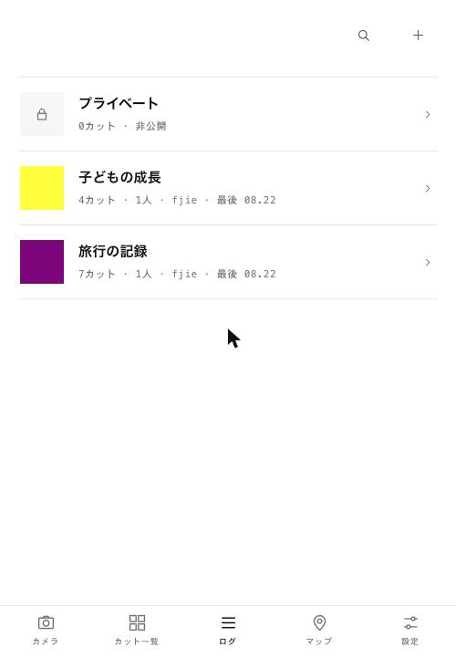

記録の入れ物である「ログ」の一覧です。各行には、最後に撮影したカットのサムネイル、カット数、参加人数、オーナー名、最終撮影日を表示します。

利用者は、他者を招待できない専用のログ（「プライベート」）を必ず一つ保有します。保存先を指定せずに撮影したカットは、既定でこのログに保存されます。

画面右上の各アイコンから、次の操作を行えます。

| アイコン | 機能 |
| --- | --- |
| 検索 | ログのタイトルおよびオーナー名による絞り込み |
| ＋ | ログの新規作成、および招待コードによる既存ログへの参加 |

### 2.2 カレンダー

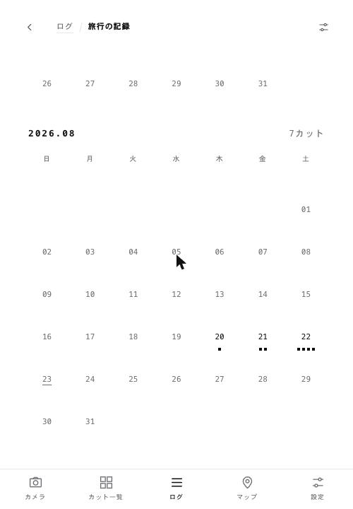

ログを選択すると、月別のカレンダーを表示します。カットが存在する日には、その件数に応じた点を表示します。

月ごとの表示を縦方向に連結しているため、スクロールのみで過去に遡れます。画面を開いた時点では最新の月を表示します。

### 2.3 その日の詳細（連続再生）

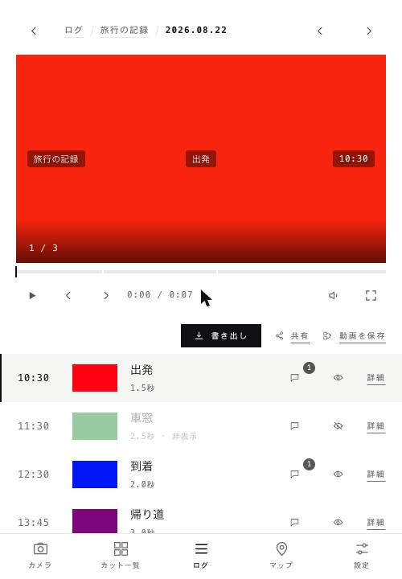

カレンダーの日付を選択すると、その日のカットを連続再生する画面へ遷移します。本アプリケーションの中核となる画面です。

**連続再生の仕組み**

内部で2つの映像要素を交互に使用し、一方を再生している間にもう一方へ次のカットを読み込みます。切り替わりの時点で表示を入れ替えることで、複数のカットを一本の動画として再生します。動画ファイルの再生成は行いません。

再生位置を示すバーは、その日の全カットを通した時間軸として機能します。カットの区切りは細い間隔で示され、任意の位置への移動（シーク）にも対応します。

**画面上の表示**

映像には、左に**ログのタイトル**、中央に**メモ**、右に**撮影時刻**を重ねて表示します。この配置は、後述する「動画を保存」で書き出す動画にも同一の位置で焼き込まれます。

**クリップ一覧**

再生画面の下部には、その日のカットを時刻順に一覧表示します。各行では次の操作を行えます。

| 操作 | 内容 |
| --- | --- |
| 行の選択 | その位置から再生を開始します |
| 吹き出しアイコン | コメントの閲覧および投稿を行います（件数を併記） |
| 目のアイコン | 表示・非表示を切り替えます |
| 詳細 | カットの詳細画面を開きます |

非表示に設定したカットは連続再生の対象から除外されますが、削除はされません。目のアイコンから随時、表示状態へ戻せます。この設定はサーバーに保存されるため、同一ログの参加者全員に共通して適用されます。

### 2.4 カット一覧

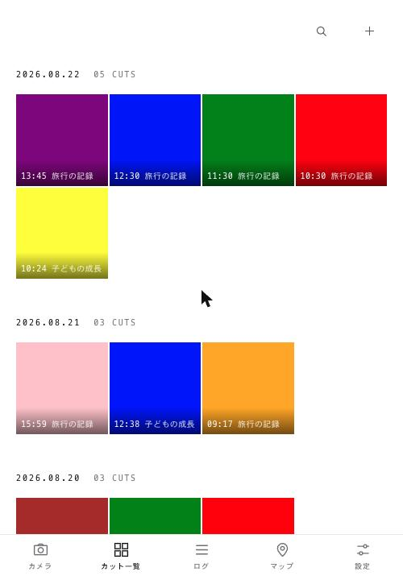

すべてのログを横断し、撮影日ごとにカットを一覧表示します。各サムネイルには撮影時刻と所属ログを併記します。

画面右上の各アイコンから、次の操作を行えます。

| アイコン | 機能 |
| --- | --- |
| 検索 | メモの文言、および投稿者による絞り込み |
| ＋ | 端末内の動画ファイルの取り込み（複数選択可） |

### 2.5 カットの選択操作

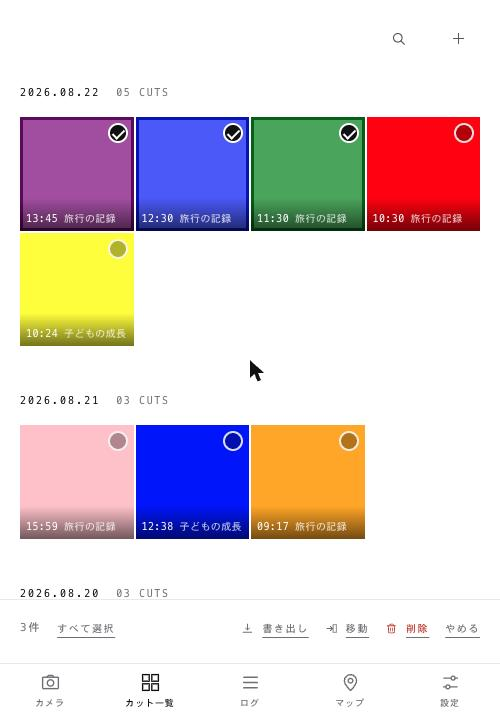

サムネイルを長押しすると選択モードに移行します。選択中は画面下部に操作バーが表示され、複数のカットに対して書き出し・移動・削除を一括して実行できます。

### 2.6 カットの詳細

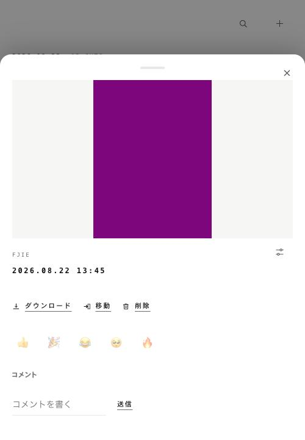

個々のカットの詳細画面です。下部から立ち上がるシート形式で表示され、シート外の領域を選択するか、右上の閉じるボタン、または下方向へのスワイプによって閉じられます。

再生、ダウンロード、他のログへの移動、削除に加え、絵文字による反応とコメントの投稿を行えます。

右上の調整アイコンを選択すると、メモの編集欄と、撮影日時・タイムゾーン・解像度・再生時間・使用カメラ・撮影位置・ファイルサイズ・チェックサム等のメタデータを表示します。

### 2.7 マップ

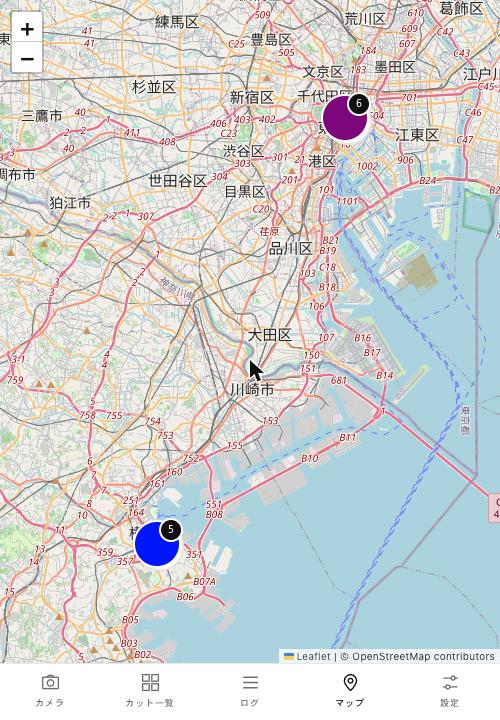

撮影位置の記録があるカットを地図上に表示します。地図の描画には Leaflet を使用し、地図タイルは既定で OpenStreetMap から取得します。

近接するカットは自動的に一つのピンへ統合され、統合された件数を併記します。地図を拡大すると、ピンは順次分割されます。

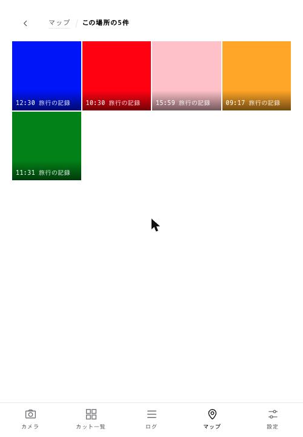

ピンを選択すると、その地点に含まれるカットの一覧へ遷移します。一覧からさらに各カットの詳細を開けます。

### 2.8 撮影

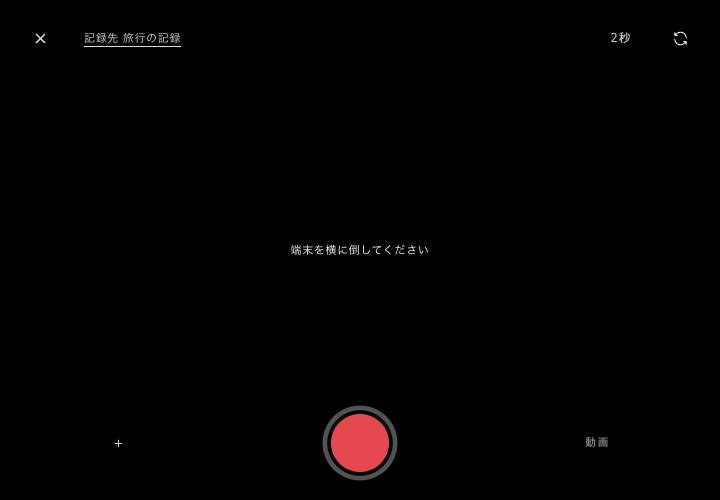

ブラウザー内でカメラを起動し、その場で撮影します。記録形式は動画のみです。

**横向きでの撮影**

横位置での撮影を基本とするため、端末が縦向きの状態であっても、撮影画面は横向きで表示されます。端末を時計回りに倒すことで、そのまま正しい向きになります。

**撮影時間**

シャッターを選択すると、ログごとに設定された秒数（既定：2秒）が経過した時点で自動的に停止します。シャッターの外周を白い線が一周することで、経過時間を示します。

**レンズの選択**

端末が利用可能と報告したカメラを判定し、「自動」「0.5×」「1×」「望遠」「前面」といった簡潔な名称に整理して表示します。既定では「自動」（複数のレンズを端末側で自動的に切り替える背面カメラ）を使用します。この構成が、画質および手ぶれ補正の面で最も良好な結果となります。

**ズーム**

端末がカメラ本体のズームに対応している場合はその機能を使用し、対応していない場合は表示上の拡大で代替します。スライダー、倍率ボタン、二本指の操作のいずれでも調整できます。

**撮影位置の記録**

端末の位置情報の使用が許可されている場合に限り、撮影位置を併せて記録します。許可されていない場合も、撮影は問題なく行えます。

> **補足：** ブラウザーからのカメラ制御には、端末標準のカメラアプリケーションと同等の映像処理（シネマティック手ぶれ補正等）が適用されません。これは Web アプリケーションの構造上の制約です。標準アプリケーションで撮影した動画を使用する場合は、カット一覧の「＋」から取り込んでください。

### 2.9 動画の保存と書き出し

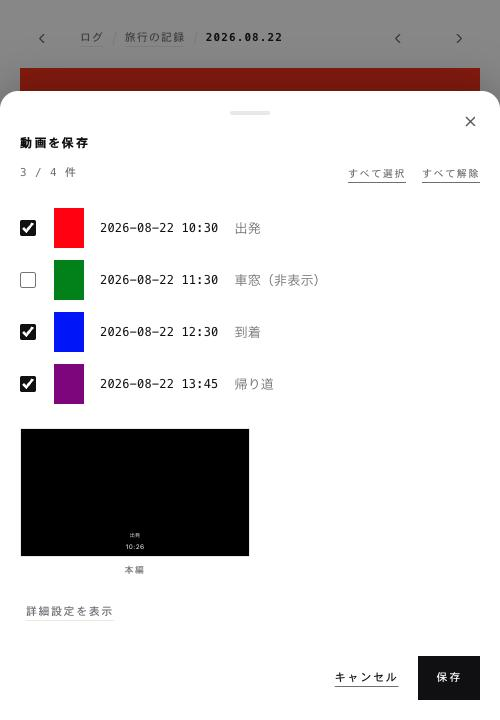

その日の詳細画面から、次の3種類の操作を実行できます。いずれも、対象に含めるカットを改めて選択したうえで実行します。非表示に設定したカットも一覧には表示され、既定では選択されていない状態となります。

| 操作 | 内容 |
| --- | --- |
| 書き出し | 元の動画ファイル、サムネイル、`cuts.json`、`cuts.csv` を ZIP 形式で取得します |
| 共有 | 閲覧用リンクを発行します。パスワード、有効期限、ダウンロードの可否を設定でき、発行後の停止も可能です |
| 動画を保存 | 選択したカットを一本の MP4 ファイルへ結合します（サーバー側の ffmpeg による処理） |

「動画を保存」では、画面サイズ、余白の扱い、背景色、フレームレート、文字の焼き込み位置および書式、表紙の有無を設定できます。通常は「詳細設定を表示」の内側に格納されており、必要な場合にのみ展開します。設定内容は保存され、次回以降も同一の設定が適用されます。

### 2.10 ログの設定

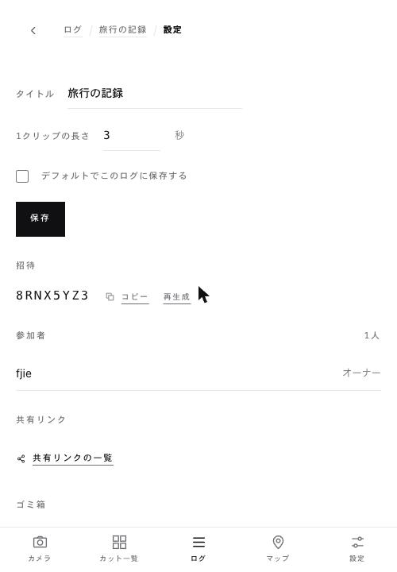

ログごとの設定を行う画面です。カレンダー画面の右上から開きます。

| 項目 | 内容 |
| --- | --- |
| タイトル | ログの名称を変更します |
| 1クリップの長さ | 撮影時間および連続再生時の1カットあたりの表示時間を設定します（既定：2秒） |
| 既定の保存先 | 保存先を指定せずに撮影したカットの保存先として指定します |
| 招待 | 招待コードの確認、複製、再生成を行います |
| 参加者 | 参加者の確認と、オーナーによる除外を行います |
| 共有リンク | 発行済みリンクの確認と停止を行います |
| ゴミ箱 | 削除したカットの確認と復元を行います |

### 2.11 全体の設定

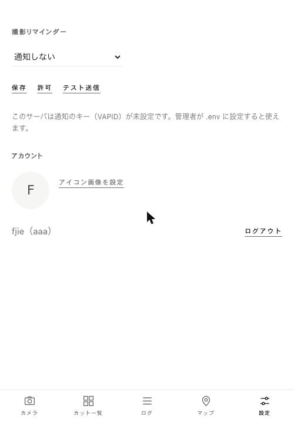

利用者ごとの設定を行う画面です。

| 項目 | 内容 |
| --- | --- |
| 撮影リマインダー | 通知の方式を設定します（毎時、指定時刻、ランダム）。通知機能の使用は必須ではありません |
| アカウント | アイコン画像の設定および削除、ログアウトを行います |

アイコン画像は、コメントの表示時にも併せて使用されます。

---

## 3. 導入手順

### 3.1 Docker を使用する場合（推奨）

```bash
git clone https://github.com/kouheisatou/cutlog.git
cd cutlog
cp .env.example .env      # 変更せずとも動作します
docker compose up -d
```

`http://localhost:8787` を開き、最初の利用者を登録してください。最初に登録した利用者が管理者となります。

### 3.2 Node.js で直接実行する場合

```bash
npm install
npm start
```

Node.js 22 以降が必要です（標準モジュールの `node:sqlite` を使用するため）。動画の結合機能を使用する場合は、別途 ffmpeg が必要です。

ビルド工程はありません。フロントエンドは素の ES モジュールで構成されており、ファイルを保存して再読み込みすれば変更が反映されます。

### 3.3 HTTPS での公開について

カメラ、位置情報、プッシュ通知の各機能は、ブラウザーの仕様上、安全なコンテキスト（HTTPS または `localhost`）でのみ動作します。`localhost` 以外のアドレスで運用する場合は、HTTPS の構成が必須となります。

構成例については [docs/SELF_HOSTING.md](docs/SELF_HOSTING.md) を参照してください。

---

## 4. 設定項目

設定はすべて `.env` ファイルで行います。詳細は [docs/CONFIGURATION.md](docs/CONFIGURATION.md) を参照してください。

| 目的 | 設定項目 |
| --- | --- |
| PostgreSQL を使用する | `DB_DRIVER=postgres` / `DATABASE_URL` |
| 動画を S3 互換ストレージに保存する | `STORAGE_DRIVER=s3` / `S3_BUCKET` ほか |
| Google アカウントでログインする | `OIDC_ISSUER` / `OIDC_CLIENT_ID` / `OIDC_CLIENT_SECRET` |
| 特定ドメインのみ許可する | `OIDC_ALLOWED_DOMAINS` |
| プッシュ通知を使用する | `npm run vapid` で生成した `VAPID_*` を設定 |
| 新規登録を停止する | `AUTH_OPEN_SIGNUP=false` |
| 1カットの既定の長さを変更する | `CUT_SECONDS_DEFAULT` |
| 地図タイルの配信元を変更する | `MAP_TILE_URL`（空欄に設定すると外部通信を行いません） |

---

## 5. 更新手順

サーバー上の cutlog を更新する場合は、リポジトリに同梱の `deploy.sh` を使用します。git からの取得、イメージの再構築、コンテナの入れ替え、稼働確認までを一括して実行します。

```bash
cd /opt/cutlog
./deploy.sh              # origin/main の最新版へ更新します
./deploy.sh v0.2.0       # タグ、ブランチ、コミットを指定します
./deploy.sh --status     # 現在の状態のみを確認します
./deploy.sh --rollback   # 直前のバージョンへ戻します
```

稼働確認（`/api/healthz`）に失敗した場合は、直前のバージョンへ自動的に復帰します。`.env` は git の管理対象外であるため、更新後もサーバー固有の設定は保持されます。

---

## 6. 動作要件

| 項目 | 要件 |
| --- | --- |
| 実行環境 | Node.js 22 以降、または Docker |
| データベース | SQLite（既定）、または PostgreSQL |
| ファイル保存先 | ローカルディスク（既定）、または S3 互換ストレージ |
| 動画の結合 | ffmpeg（Docker イメージには同梱済み） |
| ブラウザー | Safari、Chrome、Firefox の各最新版 |

大規模な構成については [docs/ARCHITECTURE.md](docs/ARCHITECTURE.md) を参照してください。Web サーバーと動画処理を別のプロセスへ分離する構成にも対応しています。

---

## 7. ライセンス

MIT License. 詳細は [LICENSE](LICENSE) を参照してください。
